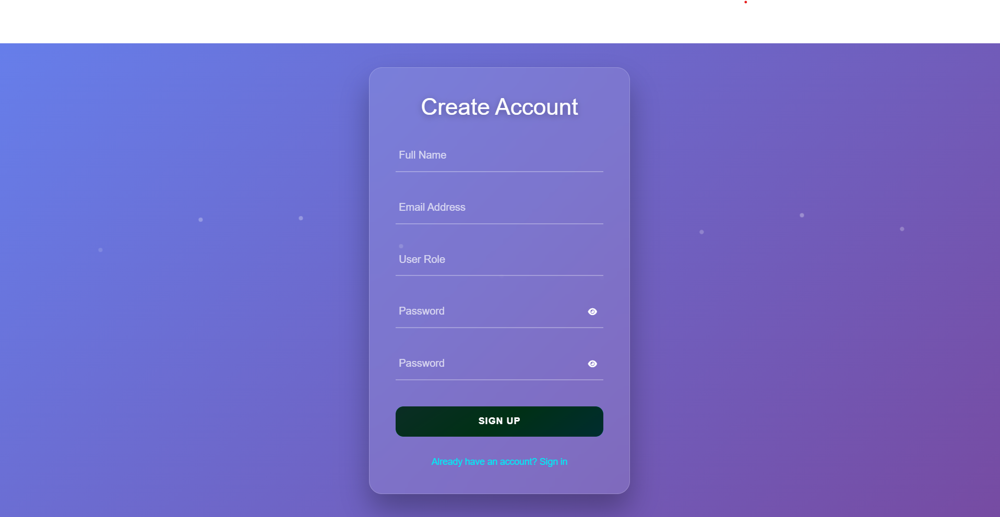
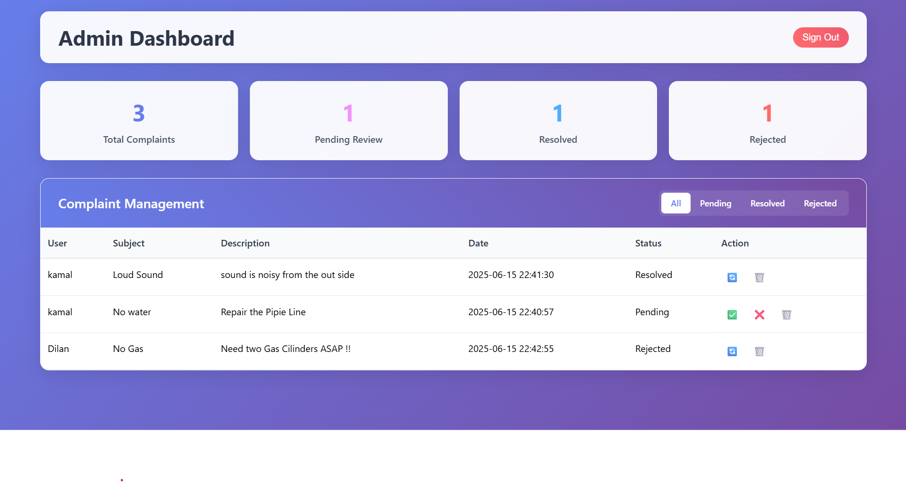
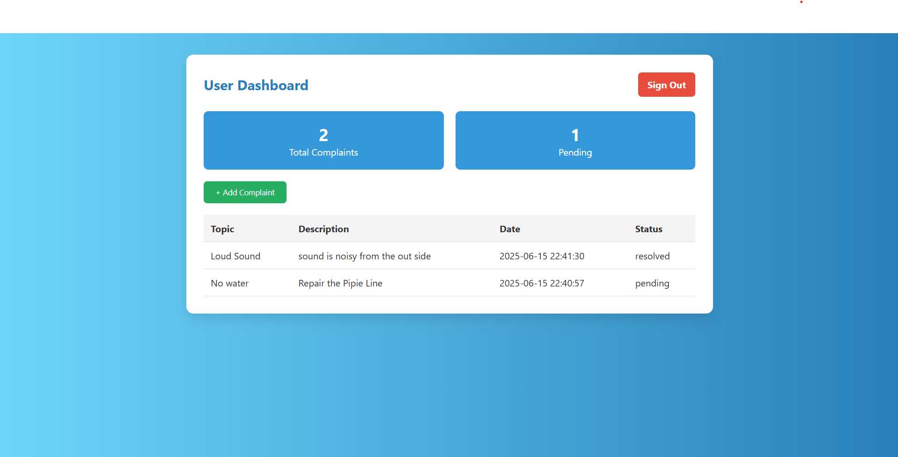

# 📝 Complaint Management System

A **JSP + Servlet-based web application** that allows users to submit complaints and admins to manage them through a simple, role-based dashboard.

This project was developed as part of the **Advanced API Development** module in the **IJSE GDSE program**, following **strict MVC**, **synchronous form submission**, and **DBCP**-based JDBC connectivity guidelines.

---

## 📌 Project Overview

### 🎯 Features

**User Functionality**
- User registration and login
- Submit a new complaint
- View complaint status

**Admin Functionality**
- Admin login
- View all complaints
- Filter by status
- Update and delete complaints

---

## 🛠️ Technologies Used

| Layer     | Technologies                                      |
|-----------|---------------------------------------------------|
| Frontend  | HTML, CSS, Bootstrap, jQuery (no AJAX used)       |
| Backend   | JSP, Servlets (Jakarta EE), JavaBeans, JDBC, DBCP |
| Database  | MySQL                                             |
| Server    | Apache Tomcat                                     |
| Pattern   | MVC Architecture                                  |

---
## Project Screenshots

### Login Page


### Admin Page


### User Page



## ⚙️ Setup & Configuration Guide

### 📥 Prerequisites

- Java 8 or higher
- Apache Tomcat 9 or higher
- MySQL Server
- Git
- Any IDE (VS Code, IntelliJ)

### 🔧 Steps to Run Locally

1. **Clone the repo**:
   ```bash
   git clone https://github.com/DiilaNa/Complaints-Management_System.git
2.Open project in your IDE (e.g. VS Code or IntelliJ)

3.Import MySQL database:
Use the provided SQL script (complaints.sql) to create required tables and sample data.

4.Configure Tomcat server in your IDE

5.Run the application and access it at:http://localhost:8080/Complaints-Management_System/

### Project Structure

Complaints-Management_System/
├── src/
│   ├── controller/        # Servlet classes
│   ├── dao/               # Data Access Object classes
│   ├── model/             # JavaBeans (DTOs)
│   └── util/              # DBCP connection pooling setup
├── web/
│   ├── views/             # JSP files (login.jsp, dashboard.jsp, etc.)
│   ├── css/               # Custom styles
│   ├── js/                # JavaScript files
│   └── WEB-INF/           # web.xml config
├── assets/                # Screenshots (add here)
├── README.md
└── complaints.sql         # SQL dump for database setup

## 👨‍💻 Author - Dilan Liyanaarachchi
## 📫 GitHub - https://github.com/DiilaNa

### 📈 Commit History
This project maintains a clear and chronological commit history, showing incremental development:

✅ Project initialization

✅ Database integration with JDBC + DBCP

✅ User/Admin login

✅ Complaint submission and management

✅ Form validation, UI enhancements

✅ Final bug fixes and testing

## 📜 License
This project is developed for educational purposes only and is not intended for commercial use.